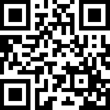

# Finding and Organizing Shared Living Arrangements

<!--  -->

---

- Program: Innovationsscheck mit Selbstbehalt (FFG)  

- Business partner  
- Research partner: Researchstudio Smart Agent Technologies  

Note:

- Finding and Organizing Shared Living Arrangements
- Innovationsscheck mit Selbstbehalt
- FFG
- A Proptech-company + studio SAT

---

# State of the Art

Note:

- state of prop-tech -- low # of dominating platforms / too many for users
- bootstrapping / walled garden
- filtering possibilities
- high volume (fb groups)
- smaller / private groups -- indirect filter + trust

---

# Goals

Note:

- decentral / open protocol
  - build on top of _web of needs_
- artifacts:
  - reference implementations (foss)
  - ontology/data-schema @ ctxt of shared living
  - project report
    - digital ethnography
    - literature research
    - usability test (in field?)
- stop/go decision @ follow-up

---

# Innovative Aspects

Note:

- Builds on WoN + previous prop-tech project
- focusses on shared living
- pro shared living
  - cost-efficient
  - sustainability
  - support each other
  - company (espec. seniors)
- equal representation of participants (vs overrepresentation of supply @ flats/established groups)
  - ad hoc groups

---

# Expected Impact

Note:

- not a platform but protocol, thus
  - coop between existing services
  - lower barrier-of-entry for newcomers
- benefits:
  - for platforms: structured & open format => reach
  - for users: x-platform + better filtering => less-effort
  - for urban planners: info about demand
- new ontology usable by other apps and researchers
- data usable by researchers

---

# Risks

Note:

- miscalculation/scoping
- competition appearing (good tho)
- wrong (sub-)problems => iterative
- making housing market worse (dunno how?)
- privacy, application security
- power imbalances
  - landlords/ladies
  - person(s) signing lease
  - other flat-mates
- visibility of race/gender/etc
- algorithmic bias

---

# Budget & Scope

€10,000 / 80% quota &rightarrow; €12,500

@ €70/h &rightarrow; 180h

- 16h: digitial ethnography
- 16h: literature-research
- 72h: GUI-prototype update
- 24h: RDF-data-modelling
- 24h: usability testing
- 32h: report

<!--
Note:

- 16h: digi ethn: looking at flat(-mate) searches and offers (side-note: we're part of audience)
- 16h: literature-research
- 72h: representing the identified use cases in our existing GUI-prototype
- 24h: RDF-modelling / representation of shared living (including the people, the group, the space, and the contract)
- 24h: usability testing (in the field if possible)
  - (e.g. via Wizard of Ozzing in the form of manual matching, ) manuelles matching als wizard-of-oz? leute direkt anschreiben und sich als gratis makler.in anbieten (und WoN nur als buchhaltung verwenden)
- 32h: report
- NOT integration w/ platforms
- NOT (editing)
-->

<!--

# RRI Dimensions

Note:

=> kristina's sheet

- ethics
- gender equality
- open access
- governance
- public engagement
- science education
-->

---

# Matchat

GUI-prototype / Reference Client

<http://matchat.org/>

